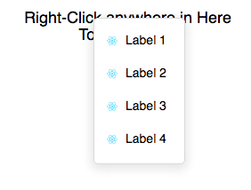

# react-ctx-menu

A simple, effective, lightweight context menu with animation made for React.



To use:

Install the component in your project:

```npm install react-ctx-menu --save```

Import the component into your project:

```javascript
import CTXMenu from 'react-ctx-menu';
```

Pass a ```ctxId```, and an array of menu items with icons, labels, and functions:

```jsx
<CTXMenu
       ctxId={'settings-text'}
       menuItems={[
            {'image': logo, 'text': 'Label 1', 'onClick': this.sample},
            {'image': logo, 'text': 'Label 2', 'onClick': this.sample},
            {'image': logo, 'text': 'Label 3', 'onClick': this.sample},
            {'image': logo, 'text': 'Label 4', 'onClick': this.sample}
       ]}
/>
```

Where ```logo``` is an image file imported into the parent component:

```javascript
import logo from './logo.svg';
```

The ```ctxId``` is the area in which you'd like right-click functionality. Add a unique ```id``` to your right-clickable element, and react-context-menu will be available anywhere within that element.
